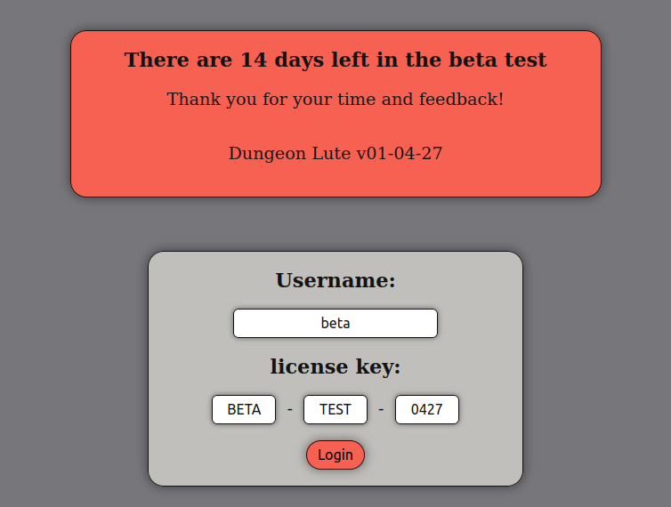
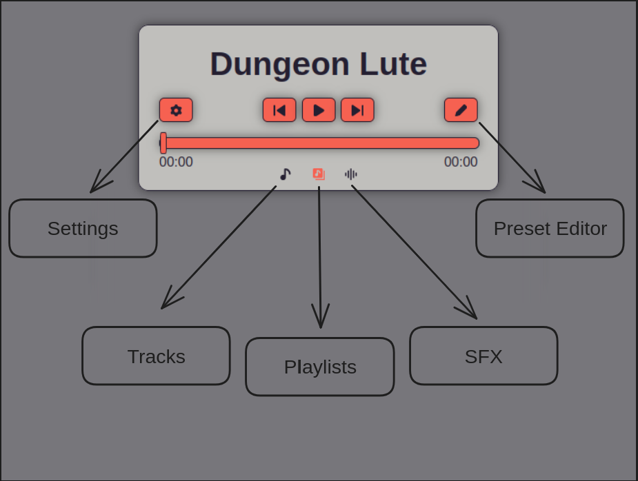
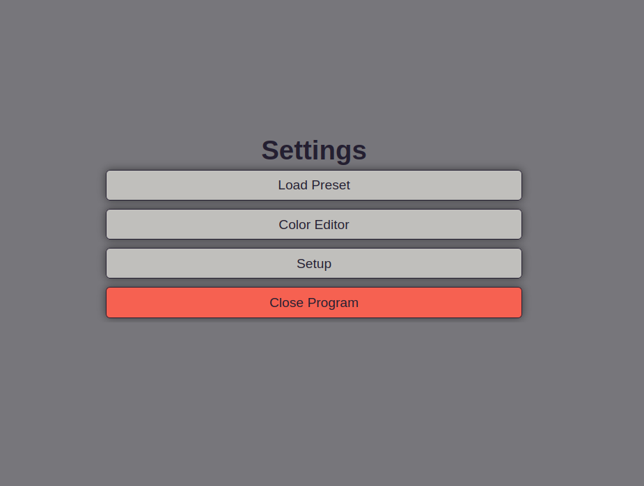
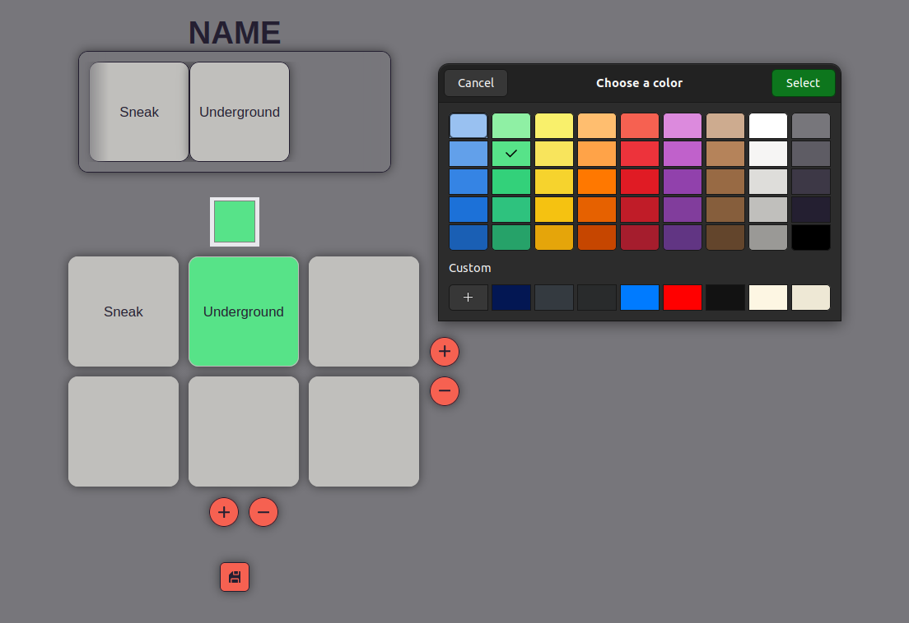
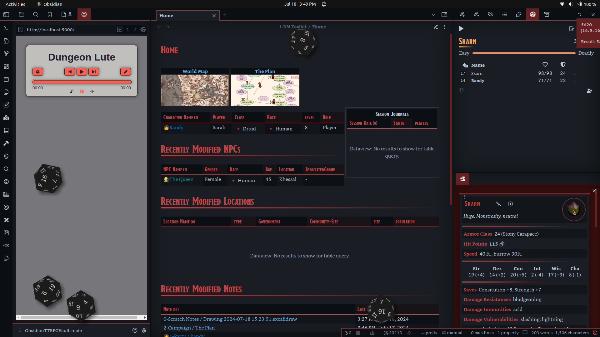

# Dungeon lute - beta v01.04.27

Dungeon Lute is a ttrpg music manager that runs locally on your machine in a browser

## Installation

Download the latest release, and select the .zip for your OS, currently supporting:

- Windows 11
- Linux Ubuntu 22.04.3 LTS ( might work on other distros, would love to know )

Then unzip the folder to wherever you would like to use it, and use the executable to run it.

A Note for Windows, as this is a new program, and not signed, windows defender will attack and quarantine it with a vengence. A Signing liscense costs a fat enough chunk of money that I will not be signing this for now. In order to still provide some sense of a legit program I have uploaded the .zip to <https://www.virustotal.com/>, feel free to do the same with what you download to verify it is the same program.

For Virus Total:

- Linux: [Check the file on VirusTotal](https://www.virustotal.com/gui/file/7945df174cfc761e35022b4e746c55d03881f097b3a792ecccd6b02f0e81ea66?nocache=1)
  - sha-256: 7945df174cfc761e35022b4e746c55d03881f097b3a792ecccd6b02f0e81ea66
- Windows: [Check the file on VirusTotal](https://www.virustotal.com/gui/file/4be9a750ec1540c93d4655b259a3b70d8232f1dfc6cd0d788a5828f1d67ff7ae/behavior)
  - sha-256: 4be9a750ec1540c93d4655b259a3b70d8232f1dfc6cd0d788a5828f1d67ff7ae

## Questions, Comments, and Concerns

Please feel free to leave any here in this server: <https://discord.gg/ym66nuTFut/>, as this is in beta, I would greatly appreciate any feedback and comments on what need to be improved, or what is missing! Thank you for your time and considerations.

## Usage

To add a playlist to the program, add a folder to the playlists directory in the folder containing the app, The name in the program will be the nae of the folder, and all .mp3's will be recognized as songs in the playlist.

To add a sfx / ambiance, add the desired .mp3 file to the sfx directory in the folder containing the app.

To add a singleton track add the desired .mp3 file to the tracks directory in the folder containing the app.

When the app is run, naviagte to <http://localhost:5000/> in any browser on your machine to access the program. On windows machines it will open a command line prompt that will show the server running, to close the program you may close that windows

*IMPORTANT:* To close the app on linux, you must either use the shutdown option in the settings, or use System Monitor to end the process

### What can it do?

to enter the program during the beta test you must enter the beta license:

```bash
username: beta
license: BETA-TEST-0427
```



Once signed in you will be greeted with the following:



This is the main page of the program, and where most of the magic happens. You can slide the bottom view between the tracks, playlists, and sfx display, these will show whatever was in thier repective directories when the page was laoded. To update for any changes you made to the files, refresh the page.

The skip button will play a random track from the current playlist excluding the previoud song, and the previous button will play the previous song played, this can switch to a previous playlist

The settings menu looks like this:



- Load Preset will open another menu where you can load or delete presets, to change the default preset, Save it as Defalut in the preset Editor
- Color Editor will open another menu where you can customize the colors of the applcication to whatever you would like. There is also a reset to default button. If you turn it to colors that you cannot see, use the inspect tool to find the reset color button, good luck!
- Setup does nothing
- Close Program shuts down the server and refreshes the page

The Preset editor looks like this:



You can name the Preset by using the textbox at the top of the page. name it Default to make it load automatically

To create a preset you can use the + / - handles to increase and decrease the size of the soundboard grid. Currently you cannot make it wider than three cells. If that is undisireable let me know.

Once you have a chosen side, drag and drop playlists from the top menu into the slots of the grid. Any blank spaces will remain as empty area.

While a playlists is active ( clicked on ), you cna use the color picker box to set it to any color you want. The way this color picker looks depends on the browser you are using.

Once you are finished click the save button to return to the main page

One last thing to note is that as this can run in any browser, it can be used in obsidian with helpmate to streamline your gaming workflow:



## Planned Features

- Upgrades to sfx Player
- discord bot audio support
- Volume Control

for more info visit: <https://trello.com/b/AGAbDOw1/dungeon-lute>
