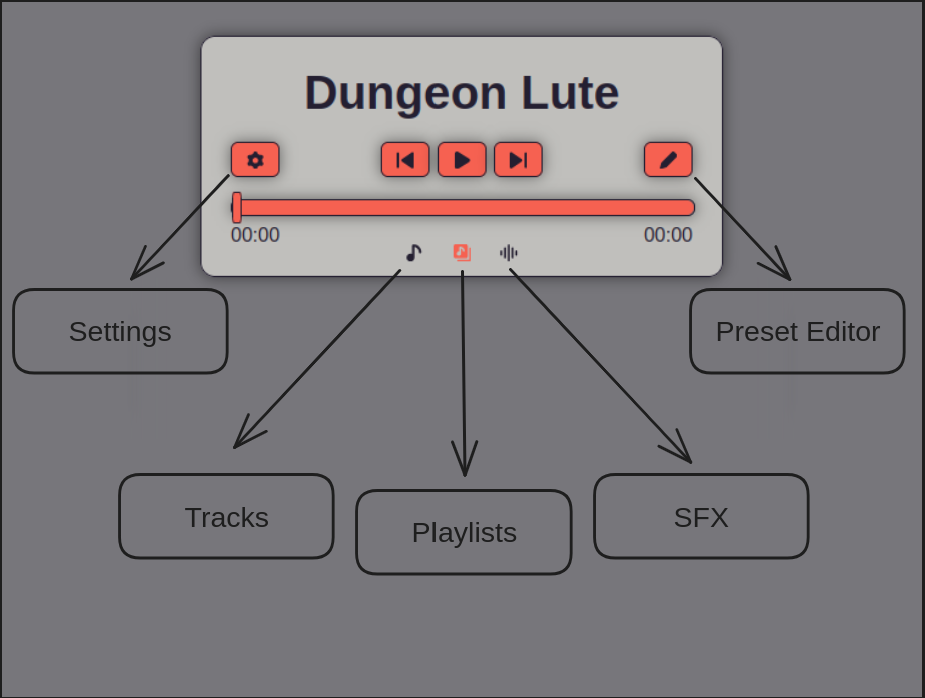

# Dungeon lute

Dungeon Lute is a ttrpg sound manager. The main goal of this program is to create a way to play playlists of songs and layer ambiance on top, running in a browser. Its creation is a direct deflection  of working on my homebrew campaign; I switched to using Obsidian for DM'ing and wanted a sound manager in the side tab.

Using python & Flask as a method to locally host a server, the program is built with the standard suite of html, css, and js.

## Installation

Dungeon Lute is avaiable in Binary for Linux Ubuntu and Windows 11, for other OS, see Building From Source below.

### Binary Installation

For users who prefer a straightforward installation process and wish to run Dungeon Lute as an executable program without compiling from source, download the latest binary release from the [Releases page](https://github.com/e-spinner/Dungeon-Lute/releases).

### Building from Source

If you wish to build Dungeon Lute from source, follow these instructions. This method requires Python 3.9 or newer.

#### Prerequisites

Ensure you have Python 3.9 or newer installed on your system. You can check your Python version by running `python --version` in your terminal.

#### Steps

1. Clone the Dungeon Lute repository to your local machine:

   ```bash
   git clone https://github.com/e-spinner/Dungeon-Lute.git
   ```

2. Navigate to the cloned directory:

   ```bash
   cd Dungeon-Lute
   ```

3. Install the required Python dependencies:

   ```bash
   pip install -r requirements.txt
   ```

4. Build the program using the provided release script. Replace `<destination>` with the directory where you want the built program to be placed. Omit `-z` if you do not wish to automatically zip the output:

   ```bash
   python release.py -d <destination> -z
   ```

This process will compile Dungeon Lute and place the executable (or optionally a zipped version) in the specified destination directory.

## Usage

This guide will assume you are running the binary version of Dungeon Lute.

### Adding your music

Dungeon Lute takes the following file structure:

```bash
.
├── Dungeon Lute
├── LICENSE
├── playlists
│   ├── Playlist-1
│   │   ├── song-1.mp3
│   │   └── song 2.mp3
│   └── playlist-2
│       └── song-1.mp3
├── readme.txt
├── sfx
│   ├── sfx-1.mp3
│   ├── sfx 2.mp3
│   └── sfx-3.wav
└── tracks
    └── track 1.mp3
```

Place folders of songs into the platlists directory for them to be recognized as a playlist. The name of the program will be the name of the folder. It MUST not contain any spaces.

Place .mp3 files inside of playlist folders, sfx directory, or the track directory for them to be recognized. Their names CAN contian spaces.

Additionally, .wav files can be placed inside of the sfx directory.

### Running Dungeon Lute

Run the Dongeon Lute Binary, this will start a locally hosted server that can be accessed by navigating to [http://localhost:5000](http://localhost:5000/) in any browser. Depending on your OS it will open a dialog of server logs.

### Using Dungeon Lute

When navigating to [http://localhost:5000](http://localhost:5000/) in a browser, it will automaticaly load the `Default` preset.



You can slide the active view below the control panel to show your Tracks, PLaylists, or SFX. SFX will play over the actively playing song, and the active song can be from a playlist or track.

To load a preset other than `Default` open the settings and click on preset manager. Here you can load other prestes you have created, and also delete unwanted presets.

The Settings menu also provides options for changing the colors of the program itself, and closing the program.

To create new presets you can navigate to [http://localhost:5000/edit](http://localhost:5000/edit/) or click on the button for the preset editor in the control panel shown above.


While in the Preset Editor, you can set the name of the preset with the top text box, and build a preset by dragging playlists down into the grid. You can resize the grid with the + / - handles. As of right nor you cannot have more than three columns.

When a playlist is active is will be highlighted. As shown above you can use the color picker box to change the color that playlost button will have. The color picker's appearance depends on your browser, and the colors are reset everytime you start the Preset Editor.

Once you the preset how you want, click the save button at the bottom to return to the main page.

When you click on a playlist button, it will randomly play a song from the playlist. All randomness in the program excludes playling the same file twice. While a playlist is playing the songs will appear in a list below the program. The actively playing song is displayed, and you can click on any other song in the list to play that one instead.

You can play any number of sfx at a time, and they each have their own volume control. Addtionally you can select to repeat any of the sfx until you uncheck the option. While any sfx is playing, a stop button will appear in the bottom right of the control panel. Clicking this stop button will stop ALL playing sfx.

The media controls in the Control Panel are fairly straitforward. You can pause / play the active song, and seek through the song. The next button will play a random song in the active playlist, and the rewind button will play the previously active song, not counting a track.

Below is an example of Dungeon Lute runnging inside of obsidian using Helpmate.


### Stopping Dungeon Lute

The easiest way to shudown the program is to use the Close Program button in the menu of the program, but if you must you can close the program with task manager, system monitor, or an eqivelent. Additionally if a dialog opened when you started the program you can close that to close the program.

## Contributing

I welcome contributions from everyone! Before you get started, please take a moment to review this guide to ensure a smooth contribution process.

For a detailed list of future features visit [this trello board](https://trello.com/b/AGAbDOw1/dungeon-lute).

### Reporting Bugs

If you encounter any bugs, please report them by creating an issue on this GitHub page. When reporting a bug, please try to include:

- A clear and descriptive title.
- Detailed steps to reproduce the bug.
- Expected behavior versus actual results.
- Any relevant screenshots or error messages.
- Information about your environment (e.g., operating system, Python version).

### Suggesting Enhancements

For feature requests or enhancements, please open an issue with a clear title and description. Explain why this enhancement would be useful and provide any additional context or examples where possible.

### Pull Requests

To submit a pull request:

1. Fork the repository.
2. Create a new branch for your changes (`git checkout -b my-feature-branch`).
3. Make your changes and commit them (`git commit -am 'Add some feature'`).
4. Push to the branch (`git push origin my-feature-branch`).
5. Open a Pull Request against the main repository.
